# ResearchNavigator
### Multi-Agent Research Discovery & Synthesis System

> An autonomous AI agent system that finds, ranks, and synthesizes academic research papers — turning hours of literature review into minutes.

---

## Overview

### The Problem
Researchers, students, and professionals spend hours manually searching, reading, and organizing academic papers before they can even begin understanding a new field. A typical literature review involves:
- Searching multiple databases with different query formats
- Manually reading dozens of abstracts to assess relevance
- Organizing findings into a coherent summary
- Identifying research gaps and key themes

This process is time-consuming, inconsistent, and doesn't scale.

### The Solution
ResearchNavigator is a **multi-agent AI system** that automates the entire literature review pipeline. A user types a research topic in natural language and receives a structured synthesis report with ranked papers, key findings, research gaps, and recommended reading order — in under a minute.

### Why Agents?
A single LLM prompt cannot reliably handle the full pipeline. The task requires:
- **Reasoning** about what the user is actually looking for
- **Tool use** to search external databases
- **Evaluation** to rank papers by relevance
- **Synthesis** to generate a coherent report

This naturally maps to a **multi-agent architecture** where specialized agents handle each responsibility, coordinated by an orchestrator.

---

## Features

- **Natural Language Query** — Users describe their research interest in plain language; the system extracts a precise technical search query automatically
- **ArXiv Paper Search** — Queries the ArXiv API for relevant papers with no API key required
- **AI-Powered Ranking** — Each paper is scored 1–10 for relevance with a one-sentence justification
- **Structured Synthesis Report** — Generates a markdown report covering overview, key findings, paper summaries, common themes, research gaps, and recommended reading order
- **Field Filter** — Filter results by research domain: AI, Physics, Math, Biology, or Other
- **Year Range Filter** — Narrow results to a specific publication date range
- **Paper Count Control** — Choose how many papers to analyze (3–15)
- **Download Report** — Export the synthesis report as a `.md` file
- **BibTeX Export** — Export all ranked papers as a `.bib` citation file for use in LaTeX, Zotero, or Overleaf
- **Compare Two Topics** — Run two research pipelines in parallel and view results side by side
- **Search History** — Tracks the last 5 queries in the current session
- **Model Fallback** — Automatically falls back to smaller models if rate limits are hit

---

## Architecture

### Agent Roles

| Agent | Responsibility |
|---|---|
| **Orchestrator Agent** | Master coordinator. Parses user intent, delegates to sub-agents, returns final result |
| **Search Agent** | Queries ArXiv, filters by year and field category, ranks papers using Groq/Llama |
| **Synthesis Agent** | Reads ranked papers, generates structured markdown research report |

### System Architecture

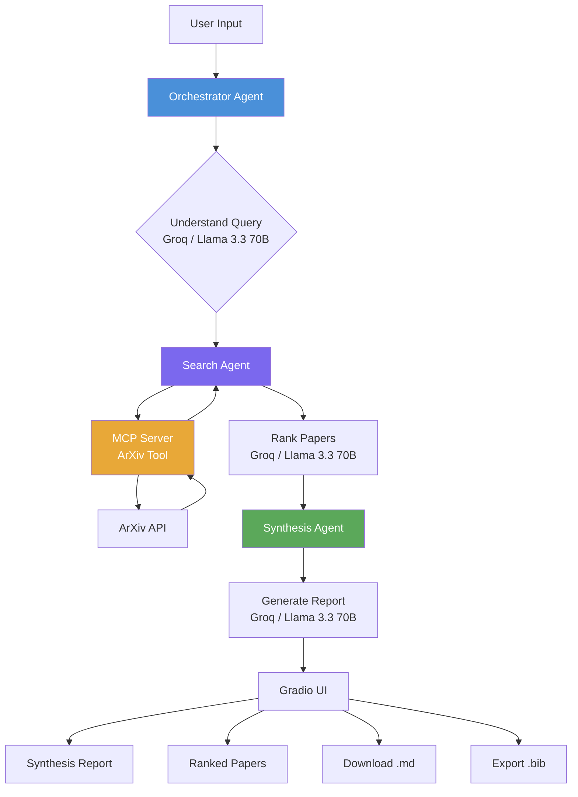

### MCP Server
A custom **Model Context Protocol (MCP) server** (`mcp_server/arxiv_server.py`) exposes two tools that agents can call:

| Tool | Description |
|---|---|
| `search_papers` | Search ArXiv for papers matching a query |
| `get_paper_details` | Fetch full details of a paper by ArXiv ID |

### External APIs

| API | Purpose | Authentication |
|---|---|---|
| Groq API | LLM inference (Llama 3.3 70B) | API key (free tier) |
| ArXiv API | Academic paper search | None required |
| Google ADK | Agent orchestration framework | API key (free tier) |

---

## How It Works

**Step-by-step user flow:**

```
1. User enters a research topic (natural language)
   e.g. "I want to understand reinforcement learning from human feedback"

2. Orchestrator Agent
   → Sends query to Groq/Llama
   → Extracts clean technical search query: "reinforcement learning human feedback RLHF"
   → Extracts human-readable topic name: "Reinforcement Learning from Human Feedback"

3. Search Agent
   → Calls MCP Server arxiv_server with the clean query
   → MCP Server queries ArXiv API
   → Filters results by selected year range and field category
   → Returns up to N papers (user-defined)
   → Sends papers to Groq/Llama for relevance ranking
   → Returns top 5 papers with scores and justifications

4. Synthesis Agent
   → Receives ranked papers
   → Sends to Groq/Llama with structured synthesis prompt
   → Returns markdown report with:
      - Overview of the field
      - Key findings across papers
      - Individual paper summaries
      - Common themes
      - Research gaps
      - Recommended reading order

5. UI (Gradio)
   → Displays synthesis report
   → Displays ranked papers with scores
   → Enables report download (.md)
   → Enables citation export (.bib)
   → Updates search history
```

---

## Technologies Used

| Technology | Version | Purpose |
|---|---|---|
| Python | 3.10+ | Core language |
| Groq API | Latest | LLM inference (Llama 3.3 70B) |
| Google ADK | Latest | Multi-agent orchestration framework |
| MCP (Model Context Protocol) | Latest | Custom tool server protocol |
| ArXiv Python SDK | Latest | Academic paper search |
| Gradio | 6.0+ | Web UI |
| python-dotenv | Latest | Secure environment variable management |
| Hugging Face Spaces | — | Free cloud deployment |

### LLM Models Used (via Groq)

| Model | Role |
|---|---|
| `llama-3.3-70b-versatile` | Primary model for all agent reasoning |
| `llama3-8b-8192` | Fallback model if rate limit hit |
| `gemma2-9b-it` | Secondary fallback model |

---

## Project Structure

```
research-navigator/
│
├── .env                          ← API keys 
├── .gitignore                    ← Excludes .env, venv, __pycache__
├── main.py                       ← Entry point
├── ui.py                         ← Gradio interface
├── requirements.txt              ← Python dependencies
├── README.md                     ← This file
│
├── agents/
│   ├── __init__.py
│   ├── orchestrator.py           ← Master coordinator agent
│   ├── search_agent.py           ← ArXiv search & ranking agent
│   ├── synthesis_agent.py        ← Report generation agent
│   └── adk_agent.py              ← Google ADK agent definitions
│
└── mcp_server/
    ├── __init__.py
    └── arxiv_server.py           ← Custom MCP tool server
```

---

## Setup Instructions

### Prerequisites
- Python 3.10+
- Git
- A free [Groq API key](https://console.groq.com)
- A free [Google AI Studio API key](https://aistudio.google.com) (for ADK)

### Installation

**1. Clone the repository**
```bash
git clone https://github.com/lara-taan/research-navigator.git
cd research-navigator
```

**2. Create a virtual environment**
```bash
# Windows
python -m venv venv
.\venv\Scripts\Activate.ps1

# Mac/Linux
python -m venv venv
source venv/bin/activate
```

**3. Install dependencies**
```bash
pip install -r requirements.txt
```

**4. Set up environment variables**

Create a `.env` file in the root directory:
```
GROQ_API_KEY=your_groq_api_key_here
GOOGLE_API_KEY=your_google_api_key_here
```

**5. Run the application**
```bash
python main.py
```

Open your browser at `http://localhost:7860`

---

## Usage Example

### Main Interface
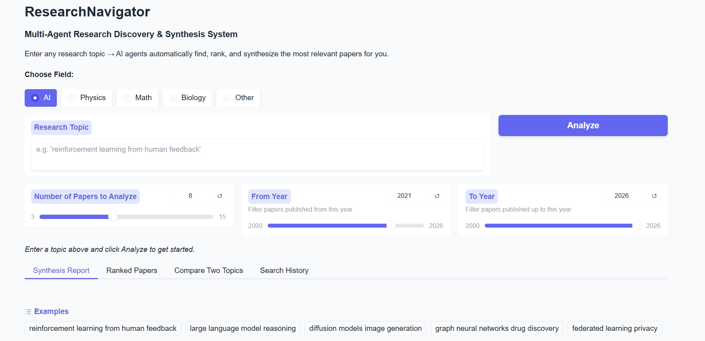

### Synthesis Report
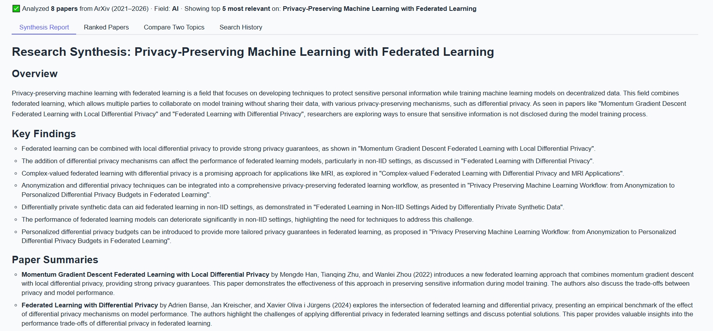

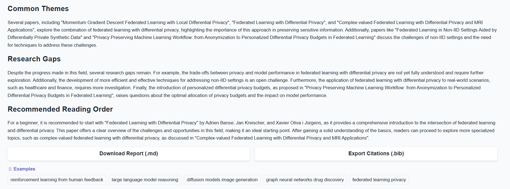

### Ranked Papers
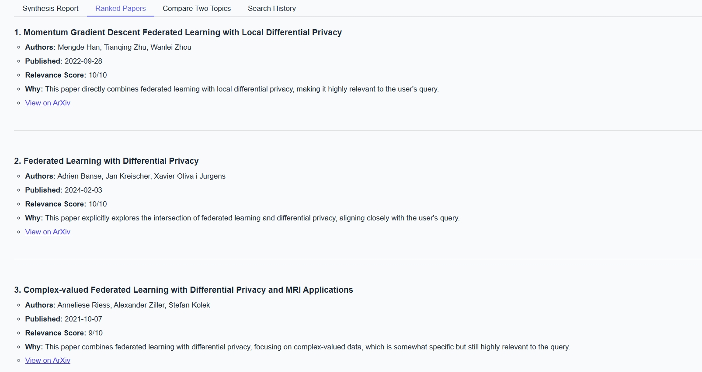

### Compare Two Topics
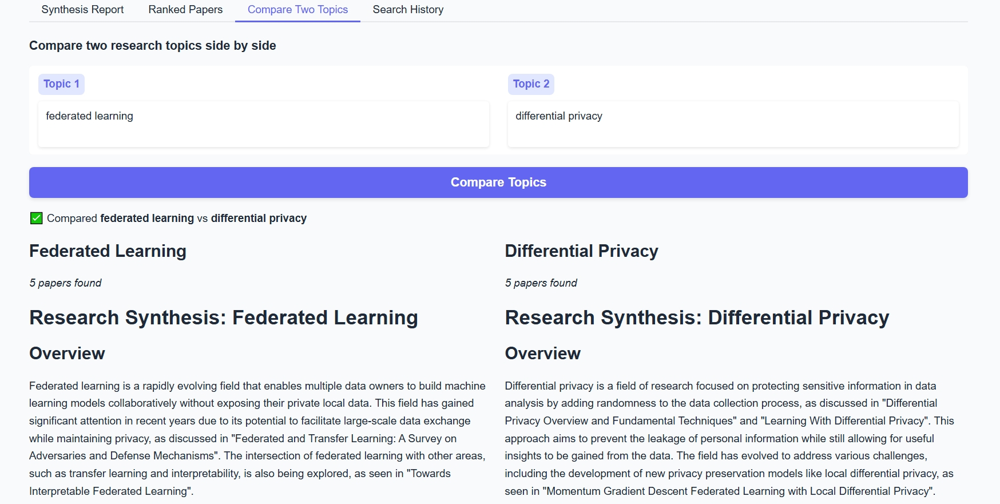

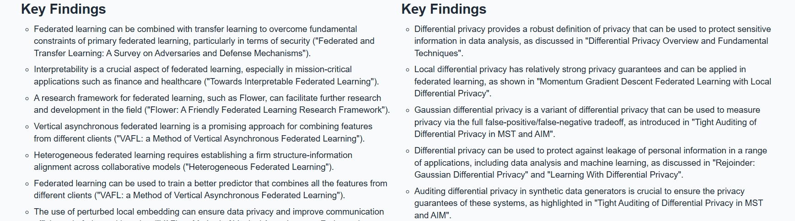

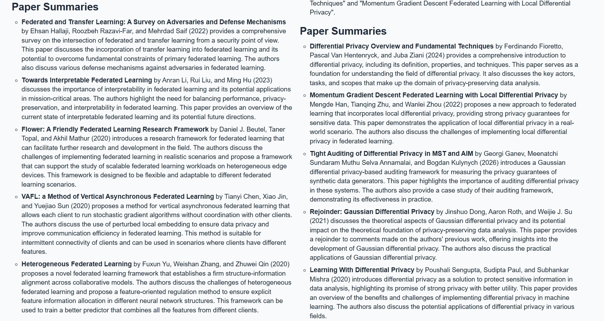

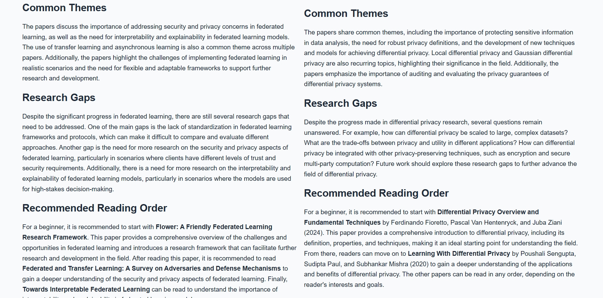

### Agent Behavior
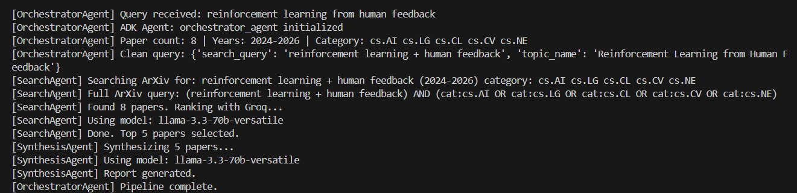

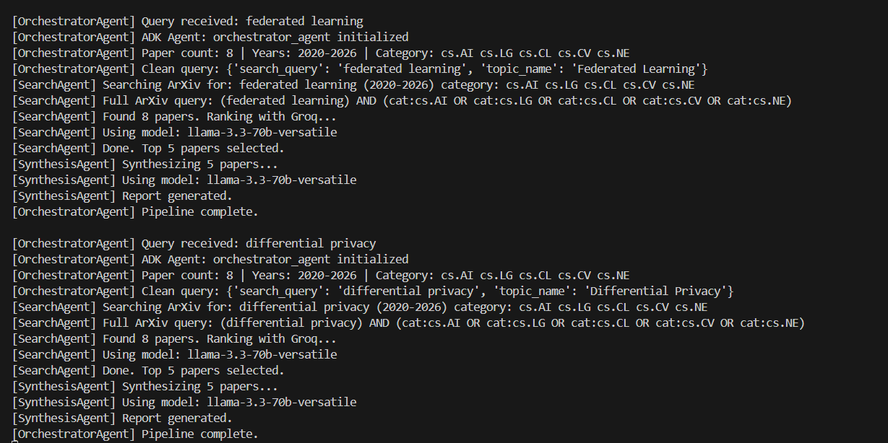
---

## AI Agent Concepts Demonstrated

This project was built as part of the **Kaggle x Google 5-Day AI Agents Intensive Capstone**.

| Concept | Implementation |
|---|---|
| **Multi-Agent System (ADK)** | Three coordinated agents (Orchestrator, Search, Synthesis) defined using Google ADK in `agents/adk_agent.py` |
| **MCP Server** | Custom Model Context Protocol server in `mcp_server/arxiv_server.py` exposing `search_papers` and `get_paper_details` tools |
| **Agent Skills** | Search skill (ArXiv query + ranking), Synthesis skill (report generation), Orchestration skill (query understanding + delegation) |
| **Security** | API keys stored in `.env` file, never hardcoded; secrets managed via Hugging Face Spaces environment variables in deployment |
| **Deployability** | Fully deployed on Hugging Face Spaces with a public URL; no login required |
| **Tool Use** | Agents use ArXiv API as an external tool via MCP; Groq API for LLM reasoning |

---

## Security

- All API keys stored in `.env` file and excluded from version control via `.gitignore`
- Deployed on Hugging Face Spaces using **Secrets** 
- No user data is stored or logged between sessions
- Search history is session-only and cleared on page refresh
- No authentication or personal data collection required

---

## Deployment

The application is deployed on **Hugging Face Spaces**:

🔗 **Live Demo:** https://huggingface.co/spaces/larataan/research-navigator

---

## Future Improvements

- **Multi-source search** — Add Semantic Scholar and PubMed alongside ArXiv
- **Full PDF analysis** — Parse full paper PDFs instead of abstracts only
- **Research Question Generator** — Suggest research directions from a broad topic
- **Persistent search history** — Save history across sessions using a lightweight database
- **User accounts** — Allow users to save and organize their research reports
- **Email export** — Send synthesis reports directly to the user's email
- **Citation graph** — Visualize how papers cite each other


